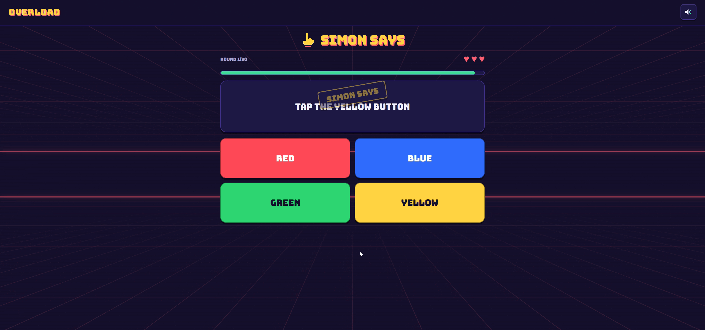
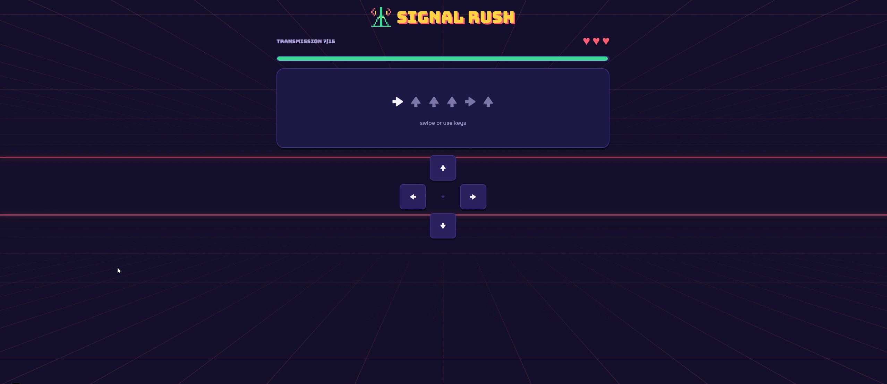
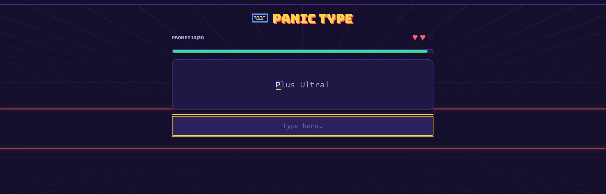
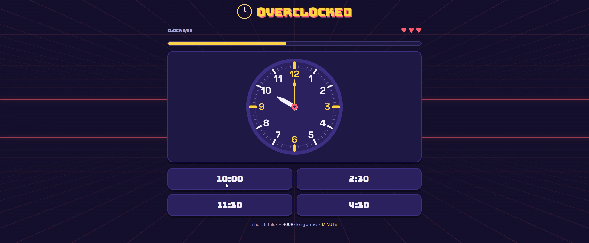
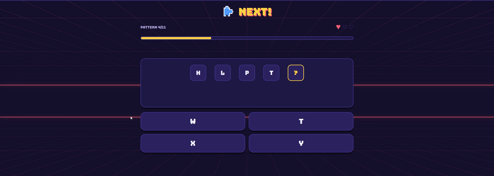
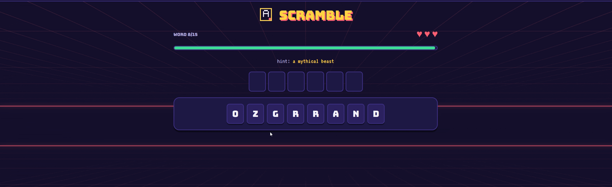
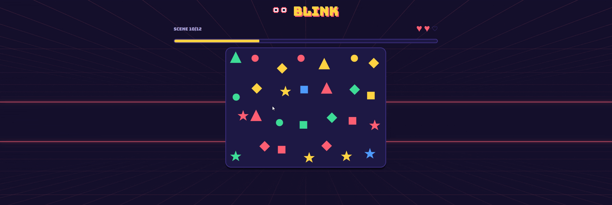

<p align="center">
  
</p>

Nine fast, stressful mini-games that test reflexes, focus, and patience.
Every game has a **daily challenge** — seeded from the UTC date, so every
player worldwide gets the identical run — plus an endless **unlimited mode**
(how long can you last?), scored by rounds survived.

<!--
  GALLERY — drop your clips in .github/demos/ using the filenames below and
  they appear here. See .github/demos/README.md for naming and sizing.

  A cell whose file doesn't exist yet renders as a broken-image icon on
  GitHub. To hide the gallery until all nine are ready, move the `-->` from
  here down to just after the closing </table> tag.
-->

<table align="center">
  <tr>
    <td align="center"><b>Simon Says</b><br><sub>obey only when Simon says</sub></td>
    <td align="center"><b>Signal Rush</b><br><sub>intercept and re-key the code</sub></td>
    <td align="center"><b>Panic Type</b><br><sub>type it exactly, fast</sub></td>
  </tr>
  <tr>
    <td></td>
    <td></td>
    <td></td>
  </tr>
  <tr>
    <td align="center"><b>Overclocked</b><br><sub>read the clock before it lies</sub></td>
    <td align="center"><b>Anomaly</b><br><sub>find the one that doesn't belong</sub></td>
    <td align="center"><b>Headcount</b><br><sub>count only what's asked</sub></td>
  </tr>
  <tr>
    <td></td>
    <td></td>
    <td></td>
  </tr>
  <tr>
    <td align="center"><b>Next!</b><br><sub>crack the rule, pick what follows</sub></td>
    <td align="center"><b>Scramble</b><br><sub>unscramble past the junk letters</sub></td>
    <td align="center"><b>Blink</b><br><sub>spot what changed</sub></td>
  </tr>
  <tr>
    <td></td>
    <td></td>
    <td></td>
  </tr>
</table>

| Route | Game | The stress |
| --- | --- | --- |
| `/simon` | **Simon Says** | 30 commands, 3 lives. Only obey when the card is stamped SIMON SAYS. From round 5 the button labels lie (Stroop trap), and idle traps punish twitchy fingers. |
| `/sequence` | **Signal Rush** | Intercept an arrow code and re-key it before the channel closes. Deep transmissions flash once, then go dark — input from memory. Wrong key resets the code and burns time. |
| `/typing` | **Panic Type** | 20 prompts, short words → punctuated phrases. Type them exactly. Typos flash red; the clock has no mercy. Score = prompts survived + accuracy. |
| `/clock` | **Overclocked** | Read the analog clock, tap the matching time — flip rounds reverse it (match the digital time to a face). Numbers vanish, distractors become hand-swap traps, and the finale clocks spin, freeze, and disappear. |
| `/anomaly` | **Anomaly** | Anomaly detection: one glyph in a seeded crowd doesn't belong. Color pops → emoji odd-one-out → conjunction search → near-identical character twins. Wrong taps burn time. |
| `/count` | **Headcount** | A mob of numbers and shapes in mixed colors, sizes, and spins — count only what the question asks for ("how many are mint?", "how many triangles?", "how many huge 7s?"). One keypad tap to answer. |
| `/pattern` | **Next!** | Sequence completion: number runs, letter ladders, spinning arrows, interleaved threads. The wrong options are the mistakes you were about to make. |
| `/illusion` | **Double Take** | Optical illusions with factual questions — which is ACTUALLY longer/bigger/lighter? Sometimes the illusion lies, sometimes it doesn't, sometimes they're the same. |
| `/blink` | **Blink** | Change blindness: the scene flashes, blinks, and flashes again with one difference. Tap it. Changes go from loud recolors to near-identical hue shifts. |

Personal bests, daily results, and the daily streak live in `localStorage`.
Results copy to the clipboard as share text, Wordle-style:

```
Overload: Signal Rush #12 — Level 9 ⚡ — ✅✅✅✅✅✅✅✅❌ — beat me: https://…/sequence
```

## Stack

- **Next.js 16** (App Router) + TypeScript + Tailwind CSS v4
- Fully static (`output: "export"`) — no backend in v1. All persistence goes
  through `lib/storage.ts`, so a future backend (accounts, leaderboards) swaps
  one module, not the games.
- Sounds are synthesized with the Web Audio API (`lib/audio.ts`) — no assets.
  Mute toggle persists.
- Mobile-first: touch/swipe/d-pad + on-screen keyboard everywhere; arrow keys,
  WASD, and number keys on desktop. `prefers-reduced-motion` respected.

## Architecture

```
lib/
  rng.ts          mulberry32 + xmur3 seeded RNG, shuffle, derangement
  daily.ts        UTC daily number + per-game daily/practice seeds, speed ramp
  storage.ts      localStorage: bests, daily results, streak, mute
  audio.ts        Web Audio synth sfx + mute pub/sub
  useCountdown.ts rAF countdown with penalty support (drives every game)
  share.ts        share-text builder + clipboard
  words.ts        word/phrase pools for Panic Type
  hooks.ts        useClientValue (hydration-safe), useMuted, reduced motion
components/
  Header, GameCard, ArcadeGrid, IntroScreen, ResultScreen, TimerBar, Lives
app/
  globals.css     ALL design tokens (colors, fonts, shadows, animations)
  simon/ sequence/ typing/ clock/ anomaly/ count/ pattern/ illusion/ blink/
                  one server page (metadata) + one client game component each
```

## Develop

```bash
npm install
npm run dev    # http://localhost:3000
npm run lint
npm run build  # static site → /out
```

## Deploy to AWS Amplify

The repo ships an `amplify.yml`. Connect the repo in the Amplify console,
accept the detected settings, and it deploys the static `/out` directory.
Optionally set `NEXT_PUBLIC_SITE_URL` to your live URL so share links and
Open Graph tags use the real domain.
