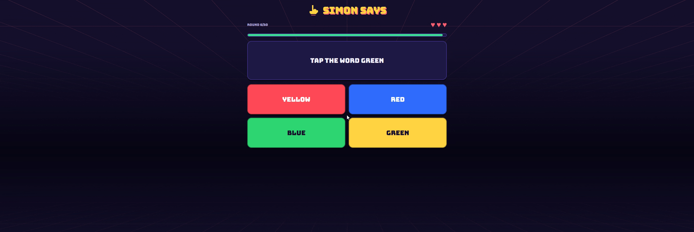
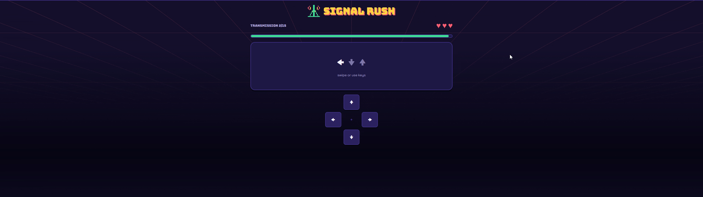
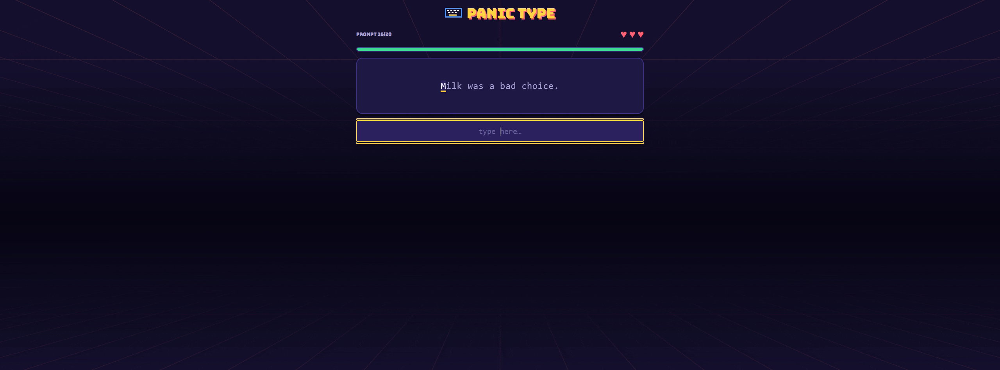
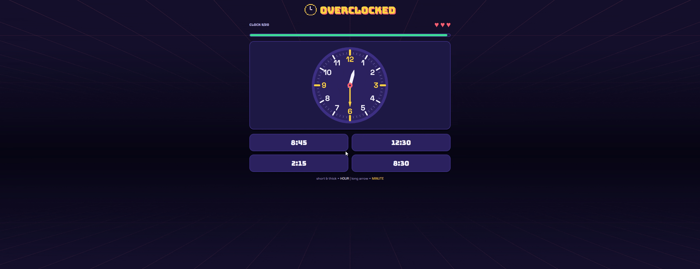
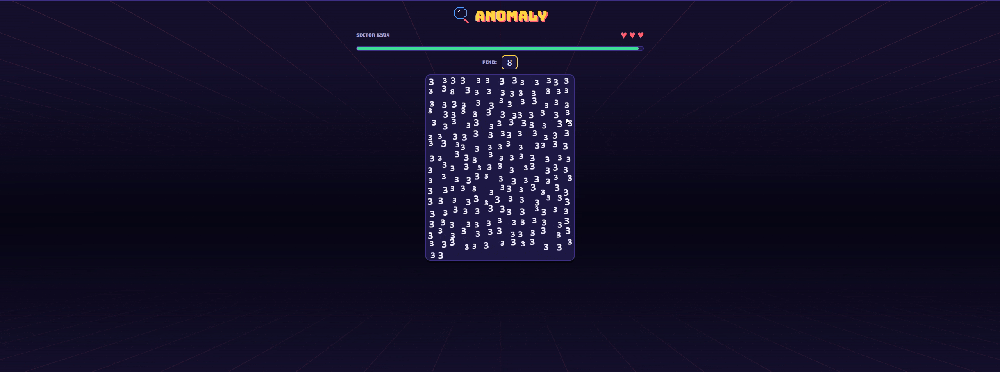
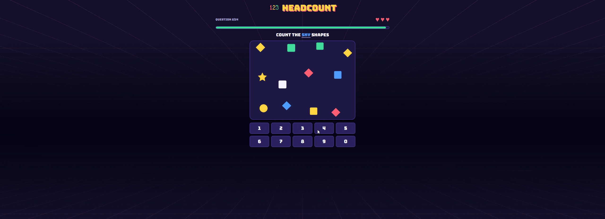
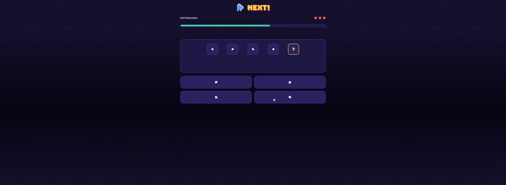
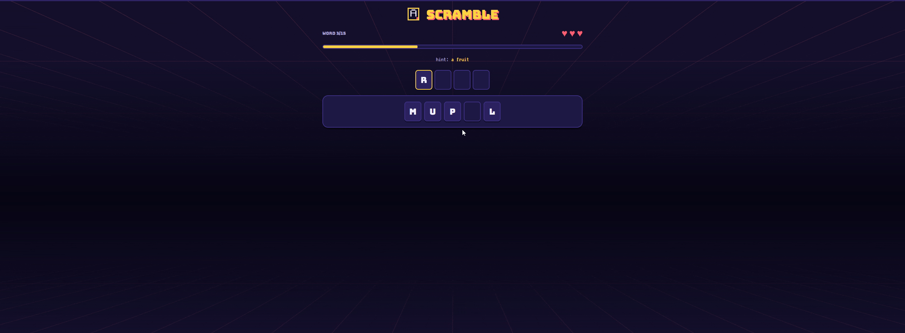
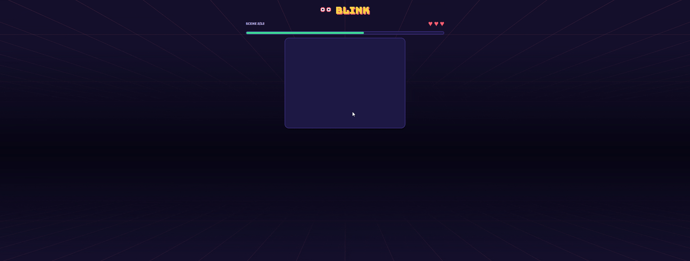

<p align="center">
  
</p>

<h2 align="center">No Downloads, No Sign-ups, Just click To Play</h2>


<p align="center">Nine quick stressful mini-games that test reflexes, focus, and patience.
Every game has a daily challenge everyday so that every player gets to try something new, plus an endless unlimited mode, scored by rounds survived with 3 lives.</p>

<p align="center"></p>
<p align="center">
  <b>SIMON SAYS</b> &nbsp;&nbsp; <br><br>
  
</p>


<p align="center">30 commands, only obey when the card is stamped SIMON SAYS</p>

<p align="center"></p>

<p align="center">
  <b>SIGNAL RUSH</b> &nbsp;&nbsp; <br><br>
  
</p>


<p align="center">In this mini game about interception, an arrow code must be typed correctly before the timer runs out. For the feep transmissions, the arrow code will flash and then go dark, must be input from memory. A wrong code resets the code and burns time</p>
<p align="center"></p>

<p align="center">
  <b>PANIC TYPE</b> &nbsp;&nbsp; <br><br>
  
</p>


<p align="center">20 rounds, short words escalating into punctuated phrases, <ins>it must be typed exactly as it is written.</ins> Typos flash red</p>

<p align="center"></p>

<p align="center">
  <b>OVERCLOCKED</b> &nbsp;&nbsp; <br><br>
  
</p>

<p align="center">Read the analog clock, tap the matching time, there is a flip round that reverses it, matching a digital time to a face. Harder rounds includes numbers vanish, distractors become hand-swap traps, and the finale clocks spin, freeze, and disappear requiring the player to memorize</p>

<p align="center"></p>

<p align="center">
  <b>ANOMALY</b> &nbsp;&nbsp; <br><br>
  
</p>

<p align="center">One glyph in a seeded crowd doesn't belong. Colour pops give way to odd-one-out, wrong taps burn time.</p>

<p align="center"></p>

<p align="center">
  <b>HEADCOUNT</b> &nbsp;&nbsp;<br><br>
  
</p>

<p align="center">A mob of numbers and shapes in mixed colours, sizes, and spins, <ins>count only what the question asks for</ins> ("how many are mint?", "how many triangles?", "how many huge 7s?"). One keypad tap to answer</p>

<p align="center"></p>


<p align="center">
  <b>NEXT!</b> &nbsp;&nbsp; <br><br>
  
</p>

<p align="center">Sequence completion: number run, letter ladders, growing gaps, spinning arrows</p>

<p align="center"></p>

<p align="center">
  <b>SCRAMBLE</b> &nbsp;&nbsp; <br><br>
  
</p>


<p align="center">Unscramble the hidden word from a pile of letter tiles BUT decoys are mixed in. The hint disappears as you climb, one correct letter is locked in green to start you off</p>

<p align="center"></p>

<p align="center">
  <b>BLINK</b> &nbsp;&nbsp; <br><br>
  
</p>

<p align="center">Change blindness: the scene flashes, blinks, and flashes again with one difference. Changes go from loud recolours to near-identical hue shifts.</p>

<p align="center"></p>
Personal bests, daily results, and the daily streak live in the user browser.
Results copy to the clipboard as share text, Wordle-style:


```
Overload: Signal Rush #12 — Level 9 ⚡ — ✅✅✅✅✅✅✅✅❌ — beat me: https://…/sequence
```

## About

- **Next.js 16** + **TypeScript** + **Tailwind CSS** 
- Fully static, no backend as of now, for now this is meant to be played in browser
- Support For Mobile: touch/swipe/d-pad + on-screen keyboard everywhere; arrow keys,
  WASD, and number keys on desktop.


